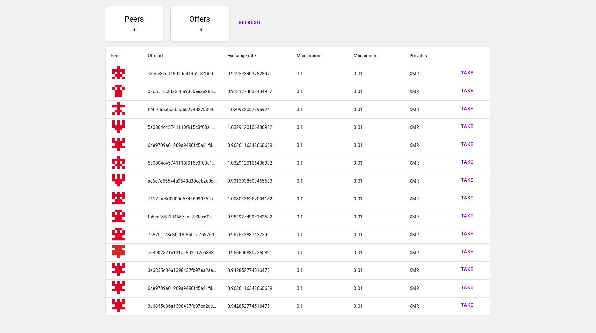
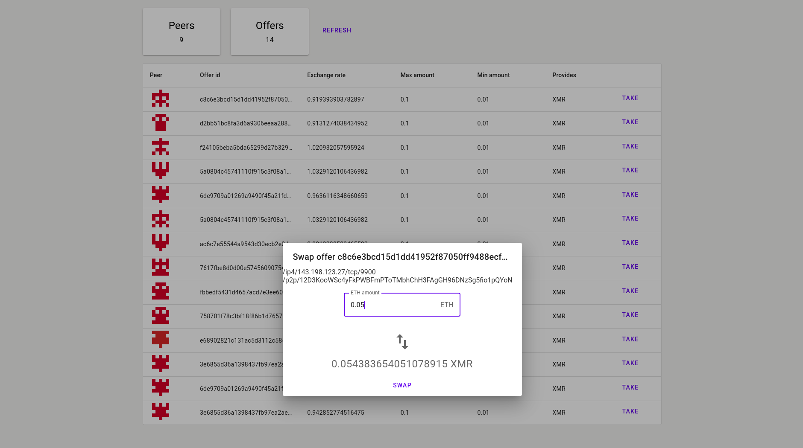
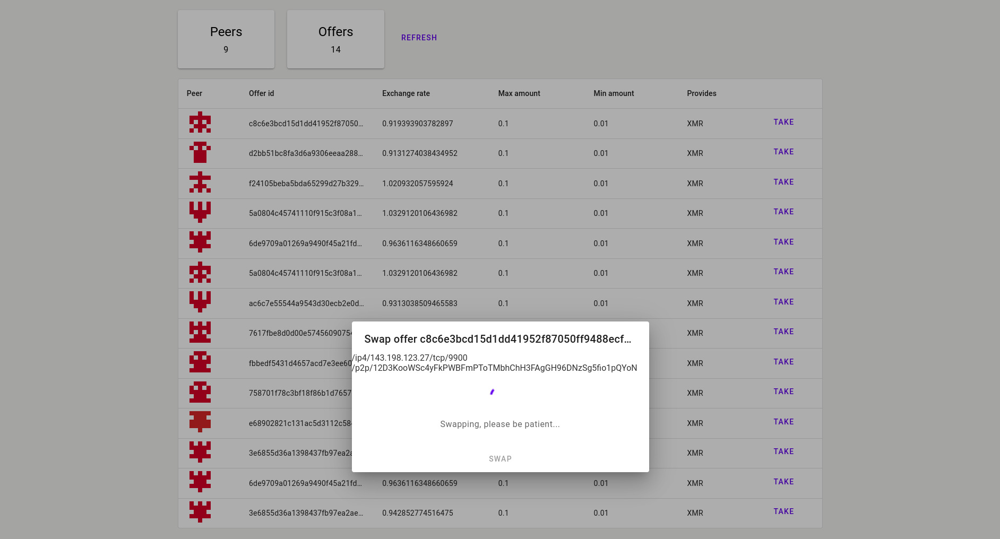

# Joining the Stagenet/Goerli network

Currently, an initial version of the swap is deployed onto the Goerli (Ethereum testnet) and Monero Stagenet networks. To join the network and try out the swap, either as a maker or a taker, please see the following.

> Note: a swap on stagenet currenty takes around 10-20 minutes due to block times.

> Note: the `swapd` process directly interacts with an unlocked Monero wallet and Ethereum private key. This is to allow for a smoother swap process that doesn't require any interaction from you once initiated. However, this effectively gives `swapd` access to all your (testnet) funds. In the future, there will be a mode that does not access your keys/wallet, but will require user interaction during a swap.

## Setup 

The atomic swap daemon requires a connection to a monero-wallet-rpc process connected to a stagenet daemon, a Goerli network endpoint, and a Goerli network private key funded with some GoETH. 

1. Install the Monero CLI if you haven't already. You can get it [here](https://www.getmonero.org/downloads/#cli):

For Linux 64-bit, you can do:
```bash
./scripts/install-monero-linux.sh
```

2. Begin the stagenet daemon and wait for it to sync. This may take a day or so. Alternatively, you can use an existing stagenet endpoint if you know of one. **You can find remote Monero nodes here: https://monero.fail/?nettype=stagenet**

```bash
./monero-bin/monerod --detach --stagenet
```

3. Create a wallet directory and start the monero-wallet-rpc process. The directory `node-keys` will store your monero wallet keys.
```bash
mkdir node-keys
./monero-bin/monero-wallet-rpc --stagenet --rpc-bind-port 18083 --disable-rpc-login --wallet-dir ./node-keys &> monero-wallet-cli.log &
```

4. Create a Goerli wallet. You can do this using Metamask by selecting "Goerli Test Network" from the networks, then creating a new account with "Create account". I'd recommend naming this new account something explicit like `goerli-swap-account`.

5. Export the private key for this account by navigating to: three dots in upper right of Metamask -> account details -> export private key. Paste this private key into a file named `goerli.key`.

6. Fund your Goerli account using a faucet: 
- https://goerli-faucet.pk910.de/
- https://goerlifaucet.com/
- https://goerli-faucet.mudit.blog/

If you don't have any luck with these, please message me on twitter/reddit (@elizabethereum) with your Goerli address, and I can send you some GoETH.

7. Obtain a Goerli JSON-RPC endpoint. You can get one from infura.io, or you can sync your own node, or ask a friend for their endpoint. 

8. Install go 1.18+ from [here](https://go.dev/doc/install).

For Linux 64-bit, you can do:
```bash
wget https://go.dev/dl/go1.18.linux-amd64.tar.gz
rm -rf /usr/local/go && tar -C /usr/local -xzf go1.18.linux-amd64.tar.gz
echo "export PATH=$PATH:/usr/local/go/bin" >> .profile
source .profile
```

9. Clone and build the atomic-swap binaries:
```bash
git clone https://github.com/athanorlabs/atomic-swap.git
cd atomic-swap
make build
```

10. Copy `goerli.key` into this directory. If you are using an Infura Goerli endpoint, copy-paste your API key into the field below following the `--ethereum-endpoint` flag. Otherwise, change `--ethereum-endpoint` to point to your endpoint. Finally, start the `swapd` atomic swap daemon process:
```bash
./swapd --env stagenet --ethereum-privkey=goerli.key --monero-endpoint=http://localhost:18083/json_rpc --wallet-file=stagenet-wallet --ethereum-endpoint=https://goerli.infura.io/v3/<your-api-key> --ethereum-chain-id=5 --contract-address=0x0adc492ADe62c4BbE8c517D4B735B5268Bbf0552 --bootnodes /ip4/134.122.115.208/tcp/9900/p2p/12D3KooWDqCzbjexHEa8Rut7bzxHFpRMZyDRW1L6TGkL1KY24JH5,/ip4/143.198.123.27/tcp/9900/p2p/12D3KooWSc4yFkPWBFmPToTMbhChH3FAgGH96DNzSg5fio1pQYoN,/ip4/67.207.89.83/tcp/9900/p2p/12D3KooWLbfkLZZvvn8Lxs1KDU3u7gyvBk88ZNtJBbugytBr5RCG,/ip4/134.122.115.208/tcp/9900/p2p/12D3KooWDqCzbjexHEa8Rut7bzxHFpRMZyDRW1L6TGkL1KY24JH5,/ip4/164.92.103.160/tcp/9900/p2p/12D3KooWAZtRECEv7zN69zU1e7sPrHbMgfqFUn7QTLh1pKGiMuaM,/ip4/164.92.103.159/tcp/9900/p2p/12D3KooWSNQF1eNyapxC2zA3jJExgLX7jWhEyw8B3k7zMW5ZRvQz,/ip4/164.92.123.10/tcp/9900/p2p/12D3KooWG8z9fXVTB72XL8hQbahpfEjutREL9vbBQ4FzqtDKzTBu,/ip4/161.35.110.210/tcp/9900/p2p/12D3KooWS8iKxqsGTiL3Yc1VaAfg99U5km1AE7bWYQiuavXj3Yz6,/ip4/206.189.47.220/tcp/9900/p2p/12D3KooWGVzz2d2LSceVFFdqTYqmQXTqc5eWziw7PLRahCWGJhKB --rpc-port=5001
```

> Note: please also see the [RPC documentation](./rpc.md) for complete documentation on available RPC calls and their parameters.

## Taker 

As a taker, you can use either the UI or `swapcli` to discover and take offers.

### UI

1. From the `atomic-swap` directory, build and start the UI. Note: you need to have node.js installed.
```bash
cd ui/
yarn install
yarn build
yarn start
```

2. Navigate to http://localhost:8080 to see the UI running. It will automatically connect to your `swapd` process and try to find offers. You can also refresh the offers by clicking `refresh`.



3. When you find an offer you'd like to take, press the `take` button to input the amount of ETH you'd like to provide. Then, confirm the offer. If all goes well, you should see the swap complete in the logs of `swapd`.




### CLI

1. Search for existing XMR offers using `swapcli`:
```bash
./swapcli discover --provides XMR --search-time 3 --daemon-addr=http://localhost:5005
# [[/ip4/127.0.0.1/tcp/9934/p2p/12D3KooWC547RfLcveQi1vBxACjnT6Uv15V11ortDTuxRWuhubGv /ip4/127.0.0.1/tcp/9934/p2p/12D3KooWC547RfLcveQi1vBxACjnT6Uv15V11ortDTuxRWuhubGv]]
```

2. Query a returned peer as to how much XMR they can provide and their preferred exchange rate (replace `"--multiaddr"` field with one of the addresses returned in the above step):
```bash
./swapcli query --multiaddr /ip4/192.168.0.101/tcp/9934/p2p/12D3KooWC547RfLcveQi1vBxACjnT6Uv15V11ortDTuxRWuhubGv
# Offer ID=cf4bf01a0775a0d13fa41b14516e4b89034300707a1754e0d99b65f6cb6fffb9 Provides=XMR MinimumAmount=0.1 MaximumAmount=1 ExchangeRate=0.05
```

> Note: the exchange rate is the ratio of XMR:ETH price. So for example, a ratio of 0.05 would mean 20 XMR to 1 ETH. Since we're on testnet, it's not critical what you set it to. 

3. a. Then, finding an offer you like, take the offer by copying the peer's multiaddress and offer ID into the command below. As well, specify how much GoETH you would like to provide, taking into account the offer's exchange rate and min/max XMR amounts.
```bash
./swapcli take --multiaddr /ip4/192.168.0.101/tcp/9934/p2p/12D3KooWC547RfLcveQi1vBxACjnT6Uv15V11ortDTuxRWuhubGv --offer-id cf4bf01a0775a0d13fa41b14516e4b89034300707a1754e0d99b65f6cb6fffb9 --provides-amount 0.05
# Initiated swap with ID=0
```

3. b. Alternatively, you can take the offer via websockets and get notified when the swap status updates:
```bash
./swapcli take --multiaddr /ip4/127.0.0.1/tcp/9934/p2p/12D3KooWHLUrLnJtUbaGzTSi6azZavKhNgUZTtSiUZ9Uy12v1eZ7 --offer-id cf4bf01a0775a0d13fa41b14516e4b89034300707a1754e0d99b65f6cb6fffb9 --provides-amount 0.05 --subscribe --daemon-addr=ws://localhost:8081
```

If all goes well, you should see the node execute the swap protocol. If the swap ends successfully, a Monero wallet will be generated in the `--wallet-dir` provided in the `monero-wallet-rpc` step (so `./node-keys`) named `swap-deposit-wallet`. This wallet will contained the received XMR.

> Note: optionally, you can add the `--transfer-back` flag when starting `swapd` to automatically transfer received XMR back into your original wallet, if you have one opened on the endpoint when starting `swapd`.

## Maker

1. Create a stagenet wallet:
```bash
curl http://localhost:18083/json_rpc -d '{"jsonrpc":"2.0","id":"0","method":"create_wallet","params":{"filename":"stagenet-wallet","password":"","language":"English"}}' -H 'Content-Type: application/json'
```
 
2. Find your stagenet address:
```bash
curl http://localhost:18083/json_rpc -d '{"jsonrpc":"2.0","id":"0","method":"get_accounts","params":{}}' -H 'Content-Type: application/json'
```

3. Fund this address with some stagenet XMR. You can try the faucets here:
- https://stagenet-faucet.xmr-tw.org/
- https://community.rino.io/faucet/stagenet/

If you don't have any luck with these, please message me on twitter/reddit (@elizabethereum) with your stagenet address, and I can send you some stagenet XMR.

4. a. Make an offer with `swapcli`:
```bash
./swapcli make --min-amount 0.1 --max-amount 1 --exchange-rate 0.5 --daemon-addr http://localhost:5005
# Published offer with ID cf4bf01a0775a0d13fa41b14516e4b89034300707a1754e0d99b65f6cb6fffb9
```

4. b. Alternatively, make an offer and subscribe to updates on it with `swapcli`:
```bash
./swapcli make --min-amount 0.1 --max-amount 1 --exchange-rate 0.5 --daemon-addr ws://localhost:6005 --subscribe
# Published offer with ID cf4bf01a0775a0d13fa41b14516e4b89034300707a1754e0d99b65f6cb6fffb9
```

> Note: the exchange rate is the ratio of XMR:ETH price. So for example, a ratio of 0.05 would mean 20 XMR to 1 ETH. Since we're on testnet, it's not critical what you set it to. 

When a peer takes your offer, you will see logs in `swapd` notifying you that a swap has been initiated. If all goes well, you should receive the GoETH in the Goerli account created earlier.

> Note: if you exit the `swapd` process, your offers are currently not saved, so when you restart you will not have any offers.

## Troubleshooting

Ideally, the exit case of the swap should be `Success`. If this is not the case, it will either be one of `Refunded` or `Aborted`.
- `Refunded` means that the swap refunded after your funds were already locked. In this case, you would lose  transaction fees.
- `Aborted` means that the swap exited before any funds were locked, so nothing was lost except time.

Neither of these should happen, so if they happen, it indicates an issue either on your side or the remote peer's side.

A few common errors are:
- `Failed to get height`: double check that your `monerod --stagenet` process is running.
- `unlocked balance is less than maximum offer amount`: you will see this if you're a maker and try to make an offer but don't have enough balance. Either get more stagenet XMR or wait for your balance to unlock.
- `already have ongoing swap`: either you or the remote peer already have a swap happening, so you need to wait for it to finish before starting another swap. Currently, `swapd` only supports one swap at a time, but support for concurrent swaps is planned.

## Trying the swap on a different network

You can also try the swap on another Ethereum or EVM-compatible testnet. However, you'll need to run your own maker nodes. 

To connect to a different Ethereum network, follow [Setup](#setup) steps 4-7 but with your desired network. Then, start `swapd` with your specified private key file, endpoint, and chain ID. Common chain IDs can be found [here](https://besu.hyperledger.org/en/stable/Concepts/NetworkID-And-ChainID/).

> Note: this command will deploy a new instance of `SwapFactory.sol` to the network, as it has not been deployed onto any other networks currently. If you want to use an already-deployed swap contract, remove the `--deploy` flag and pass in the address using `--contract-addr=<addr>`. You need to have funds in your account to deploy the contract.

```bash
./swapd --env stagenet --ethereum-privkey=<network>.key --monero-endpoint=http://localhost:18083/json_rpc --wallet-file=stagenet-wallet --ethereum-endpoint=https://<network>.infura.io/v3/<your-api-key> --ethereum-chain-id=<network-chain-id> --deploy
```

## Bug reports

If you find any bugs or unexpected swap occurrences, please [open an issue](https://github.com/athanorlabs/atomic-swap/issues/new) on the repo, detailing exact steps you took to setup `swapd` and what caused the bug to occur. Your OS and environment would be helpful as well. Any bug reports or general improvement suggestions are much appreciated.
